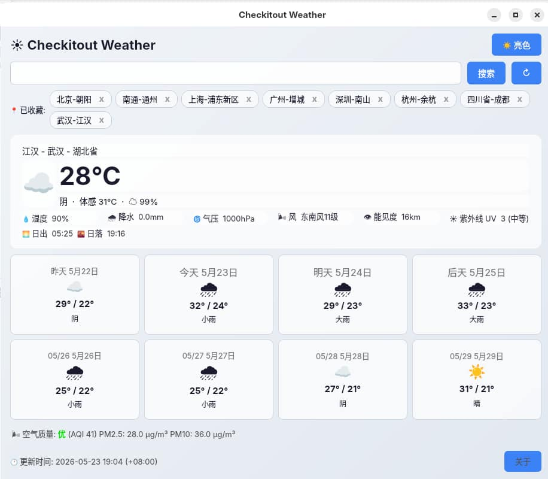

# Checkitout Weather

一款基于 [和风天气](https://www.qweather.com) API 的桌面天气应用，使用 PySide6 构建。

手动刷新（无自动刷新），即查即知。

## 功能

- 实时天气：温度、体感温度、湿度、降水、气压、风向风力、能见度
- 昨日天气 + 未来 7 天预报
- 空气质量 (AQI) 与首要污染物
- 紫外线指数与等级描述
- 日出 / 日落时间
- 城市搜索、收藏管理
- 亮色 / 暗色主题切换

## 截图



## 下载

从 [Releases](https://github.com/hellodk34/checkitout_weather/releases) 页面下载对应平台的预构建分发包

目前已构建的版本：

- Linux
- Windows

## 配置

### 1. 注册和风天气

前往 [和风天气控制台](https://console.qweather.com) 注册账号并创建一个项目。

### 2. 生成 Ed25519 密钥对

和风天气控制台推荐使用 JSON Web Token 方式认证：

> API KEY的认证方式无法提供足够的安全性，因此我们计划从2027年1月1日起，使用API KEY认证方式都将受请求量的限制。  
> 我们推荐使用JSON Web Token (JWT)的认证方式获得更高等级的安全性以及不受限的API请求。

传统的 API KEY 认证将很快受到限制。生成 Ed25519 密钥对：

```bash
# 生成私钥
openssl genpkey -algorithm ED25519 -out ed25519-private.pem

# 从私钥导出公钥
openssl pkey -pubout -in ed25519-private.pem > ed25519-public.pem
```

### 3. 配置和风天气

在和风天气控制台完成以下操作：

1. 进入 **项目管理** → 你的项目，复制出项目 ID
2. 在 **JWT 凭证** 中添加一个凭证
3. 将上一步生成的 `ed25519-public.pem` 的内容粘贴到公钥输入框中
4. 保存后你会获得一个 **Credential ID**

### 4. 填写配置

**推荐首次直接运行**，配置文件会自动生成，但是会警告没有提供必要配置，此时关闭程序，按需填入配置，更新配置文件再启动程序即可。

或者，显式的创建配置文件夹和配置文件 `~/.config/checkitout_weather/config.toml`：

```toml
[api]
host = "你的专属 Host"
project_id = "你的 Project ID"
credential_id = "你的 Credential ID"
private_key_path = "/path/to/ed25519-private.pem"

```

所有字段也可通过环境变量设置（优先级高于配置文件）：

| 环境变量 | 说明 |
|---|---|
| `QWEATHER_API_HOST` | API 专属 Host |
| `QWEATHER_PROJECT_ID` | 项目 ID |
| `QWEATHER_CREDENTIAL_ID` | JWT 凭证 ID |
| `QWEATHER_PRIVATE_KEY_PATH` | 私钥文件路径 |
| `QWEATHER_PRIVATE_KEY` | 私钥内容（直接填入 PEM 字符串） |

## 给 linux 创建 desktop 文件

```
# 这里用的是 debian13+gnome48 with wayland，测试良好
# 1. 创建 desktop 文件 ~/.local/share/applications/checkitout-weather.desktop ，内容如下
[Desktop Entry]
Name=Checkitout Weather
Comment=手动刷新查看天气
Exec=/your/path/to/CheckitoutWeather
Icon=checkitout-weather
Terminal=false
Type=Application
Categories=Utility;
StartupNotify=true

# 2. 创建桌面图标文件 ~/.local/share/icons/hicolor/scalable/apps/checkitout-weather.svg，内容即本仓库的 assets/checkitout-weather.svg 内容，复制粘贴过去即可

# 3. 更新桌面图标
update-desktop-database ~/.local/share/applications
```

## 从源码运行

### 环境要求

- Python >= 3.13
- PySide6 >= 6.6 (Qt6)

### 安装依赖

```bash
git clone https://github.com/hellodk34/checkitout_weather.git
cd checkitout_weather

# 创建python独立隔离的虚拟环境
python -m venv .venv
# 激活环境
source .venv/bin/activate # Windows: source .venv/Scripts/activate  
# 安装依赖
pip install -r requirements.txt
```

### 独立启动

```bash
python main.py
```

## 构建分发包

使用 PyInstaller 构建独立可执行文件：

```bash
pip install pyinstaller
pyinstaller --onefile --windowed --name CheckitoutWeather main.py
```

构建产物在 `dist/CheckitoutWeather`（Linux）或 `dist/CheckitoutWeather.exe`（Windows）。

## 许可

MIT License.
